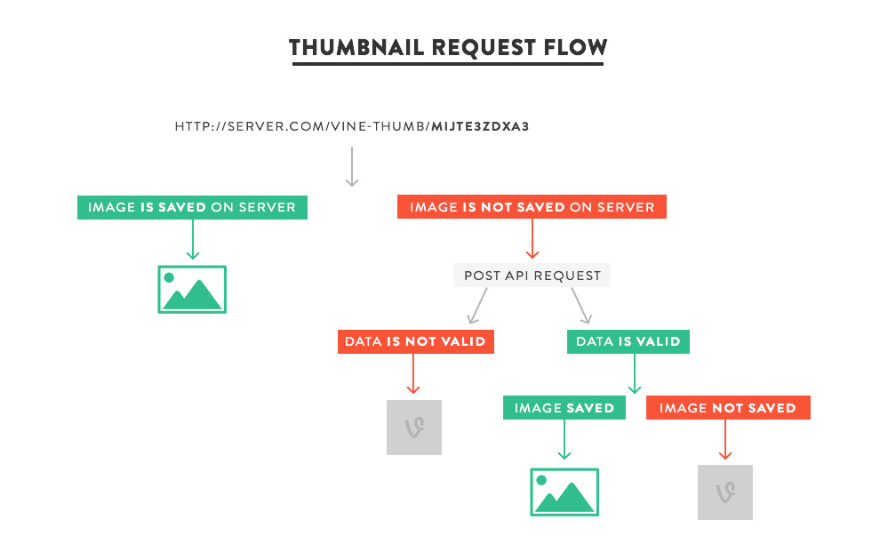

#VineThumb

Vine video embeds aren't great for progressively enhancing your web pages. The only available method for embedding Vine videos is via iframe embeds. This will lead to extra resources being downloaded on page load which may not be desirable.

I wanted my Vine embeds to match my other methods for embedding video players; only show an image on page load and - based on the users' intention to view the video, such as clicking a 'play' button - _then_ create the iframe and load the video player and its resources.


## The problem

[Unlike YouTube](http://stackoverflow.com/a/2068371/930294), Vine has no way of easily showing thumbnails for its videos.


## The solution

Vine's API is publically exposed via the XHR requests made on their new website. From this we can request data for individual videos, which includes the URL of its thumbnail image.

Using this API we can get the thumbnail of the image and with some PHP we can make a local copy of it. All you need to use is the video's ID.

If no image is found locally or via the API, a blank image with Vine's 'V' logo is served instead.




## Example

To get the thumbnail for [this Vine post](https://vine.co/v/MIjTE3ZDxa3), we just need to use the video ID (at the end of the URL) and then use it like so:

```

```


## Requirements

- PHP 5.3+
- Write permissions on file system
- .htaccess support (alternatively can be changed from using 'pretty URL' to basic URL parameters)


## Demo

View a demo of a click-embedded Vine video player that uses thumbnails [on CodePen](http://codepen.io/seanislegend/full/pjFql/).